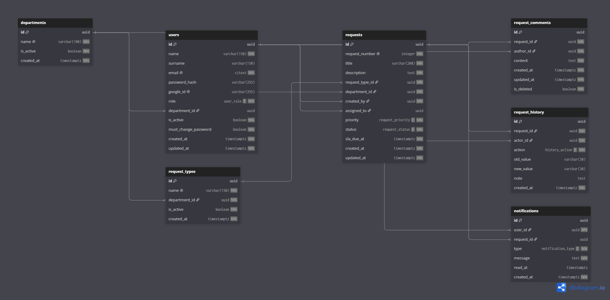

# OpsPulse

Şirket içi IT, İnsan Kaynakları ve Finans taleplerini tek bir yerden yöneten, rol bazlı bir operasyon platformu. Çalışanlar talep oluşturur, departman yetkilileri kendi departmanlarına gelen talepleri üstlenip sonuçlandırır, yöneticiler tüm sistemi izler. Talebin geçirdiği her adım kayıt altına alınır, SLA süreleri takip edilir ve güncellemeler gerçek zamanlı olarak ilgili kişilere ulaşır.

## Özellikler

**Roller**

| Rol | Yapabildikleri |
|---|---|
| Çalışan | Talep oluşturur, kendi taleplerini takip eder, yorum yazar, kişisel özetini görür |
| Departman Yetkilisi | Sadece kendi departmanının taleplerini görür; kuyruktan talep üstlenir, işler, tamamlar veya reddeder; ekibini görür |
| Yönetici | Tüm sistemi görür; kullanıcıları ve katalogu (departman, talep türü) yönetir; yorumları denetler |

**Talepler**
- Kilitli bir durum akışı: `Açık → Atandı → İşlemde → Tamamlandı / Reddedildi`. Tamamlanan veya reddedilen talep tekrar açılmaz.
- Üstlenme ve durum değişiklikleri atomik; aynı talebe iki kişi aynı anda tıklarsa sadece biri başarılı olur.
- Önceliğe göre SLA süresi (Yüksek 4 saat, Orta 24 saat, Düşük 72 saat) ve gecikme takibi.
- Oluşturma, atama, durum ve öncelik değişiklikleri `request_history` tablosuna yazılır; talep detayında tam geçmiş görünür.
- Yorumlar (düzenleme, silme), bildirimler, arama ve filtreler, kayıtlı kuyruk filtreleri.

**Analiz**
- Durum özeti, SLA uyum oranı, ortalama çözüm süresi.
- Dağılım grafikleri, zaman içinde talep hacmi, darboğaz tespiti (SLA ihlalleri, aşama süreleri, yetkili iş yükü).

**Gerçek zamanlı**
- Socket.io ile canlı talep güncellemeleri, bildirim rozeti ve kuyruk.
- Olaylar kullanıcı, departman ve talep bazlı odalara gönderilir; hiçbir olay herkese yayınlanmaz.

**Yapay zekâ önerisi (isteğe bağlı)**
- Yeni talep formunda Google Gemini, talep türü ve öncelik önerir.
- Öneri hiçbir zaman otomatik uygulanmaz ve gerçek talep türleriyle doğrulanmadan gösterilmez. API anahtarı yoksa veya servis cevap vermezse form normal şekilde çalışır.

## Güvenlik

- **İki katmanlı yetkilendirme:** rol kontrolüne ek olarak her sorgu, giriş yapan kullanıcının kendi kapsamıyla (kendi talepleri / kendi departmanı) sınırlanır. Kapsam bilgisi istemciden değil, doğrulanmış token'dan alınır.
- Kayıtta rol seçilemez; herkes "Çalışan" olarak başlar. Departman yetkilisi hesapları sadece yönetici tarafından açılır.
- Yöneticinin açtığı hesaplar tek seferlik geçici şifre alır; kullanıcı kendi şifresini belirleyene kadar backend başka hiçbir isteği kabul etmez.
- `is_active` ve şifre değiştirme zorunluluğu her istekte veritabanından yeniden kontrol edilir.
- JWT kimlik doğrulama, bcrypt ile şifre hash'leme, Google OAuth, Helmet, kısıtlı CORS.
- Giriş, kayıt, şifre değiştirme ve yapay zekâ için ayrı rate limit'ler.

## Teknolojiler

| Katman | Teknoloji |
|---|---|
| Frontend | React 19, TypeScript, Vite, Tailwind CSS 4, TanStack Query, React Router, Recharts |
| Backend | Node.js, Express, Socket.io, JWT, bcrypt, Google OAuth |
| Veritabanı | PostgreSQL |
| Yapay zekâ | Google Gemini API |
| Test | Vitest (frontend), `node --test` + Supertest (backend) |

## Mimari

```
Route → Controller → Service → PostgreSQL
```

Controller'lar ince tutulur; iş kuralları ve sorgular servis katmanındadır. `requests` tablosuna yapılan her yazma işlemi tek bir servis fonksiyonları kümesinden geçer (`createRequest`, `claimRequest`, `changeRequestStatus`, `changePriority`). Bu fonksiyonlar talebi günceller, geçmişe kaydeder ve bildirimi aynı transaction içinde oluşturur.

Veritabanı 7 tablodan oluşur: `departments`, `users`, `request_types`, `requests`, `request_comments`, `request_history`, `notifications`.



## Kurulum

### Gereksinimler
- Node.js 22+
- PostgreSQL

### 1. Veritabanı

```bash
createdb opspulse
psql -d opspulse -f db/schema.sql
```

`schema.sql` güncel şemanın tamamını içerir. `db/migrations/` altındaki dosyalar sadece eski bir veritabanını yükseltmek içindir; temiz kurulumda çalıştırılmamalıdır.

### 2. Backend

```bash
cd backend
npm install
cp .env.example .env    # değerleri düzenleyin
npm run seed            # departmanlar, talep türleri ve departman yetkilileri
npm run dev             # http://localhost:4000
```

| Değişken | Açıklama |
|---|---|
| `DATABASE_URL` | PostgreSQL bağlantı adresi |
| `JWT_SECRET` | Token imzalama anahtarı (uzun ve rastgele olmalı) |
| `CLIENT_ORIGIN` | Frontend adresi (CORS), ör. `http://localhost:5173` |
| `ALLOWED_EMAIL_DOMAIN` | Kayıt olunabilecek e-posta alan adı, ör. `sirket.com` |
| `GOOGLE_CLIENT_ID` | Google ile giriş için OAuth istemci kimliği |
| `GEMINI_API_KEY` | İsteğe bağlı. Boş bırakılırsa yapay zekâ önerisi kapalı olur |
| `GEMINI_MODEL` | Kullanılacak Gemini modeli (varsayılan `gemini-2.5-flash`) |

### 3. Frontend

```bash
cd frontend
npm install
cp .env.example .env
npm run dev             # http://localhost:5173
```

| Değişken | Açıklama |
|---|---|
| `VITE_API_URL` | Backend adresi (varsayılan `http://localhost:4000`) |
| `VITE_GOOGLE_CLIENT_ID` | Backend'deki `GOOGLE_CLIENT_ID` ile aynı değer |

### Hesaplar

- **Departman yetkilileri** `npm run seed` ile oluşturulur. Şifre: `sifre1234`
  - `it.authority@opspulse.com`, `it.authority2@opspulse.com`
  - `hr.authority@opspulse.com`
  - `finance.authority@opspulse.com`
- **Çalışan** hesabı kayıt sayfasından açılır (e-posta `ALLOWED_EMAIL_DOMAIN` ile bitmelidir).
- **Yönetici** uygulama üzerinden oluşturulamaz. Kayıt olduktan sonra veritabanında yükseltin:

```sql
UPDATE users SET role = 'ADMIN', department_id = NULL WHERE email = 'siz@sirket.com';
```

## Testler

```bash
cd backend && npm test     # gerçek PostgreSQL veritabanına karşı çalışır, önce seed gerekir
cd frontend && npm test
```

## Proje Yapısı

```
backend/
  routes/          endpoint tanımları
  controllers/     HTTP katmanı
  services/        iş kuralları ve sorgular
  middleware/      kimlik doğrulama, rate limit, hata yönetimi
  sockets/         Socket.io kimlik doğrulama ve odalar
  test/
frontend/src/
  pages/           sayfalar
  components/      ortak bileşenler ve route korumaları
  context/         oturum, socket ve sayfa başlığı
  lib/             API istemcisi ve veri hook'ları
db/                şema, şema diyagramı ve migration'lar
```

## Lisans

[MIT](LICENSE)
